# RealRehab Data Flow Documentation

Comprehensive data flow analysis and visual documentation for the RealRehab app. One unified end-to-end flow in user journey order. Each step shows: Application (user action) → Transaction (what is captured) → Processing (where and how) → Pull (from Supabase or cache, if any) → Storage (where data is written, if any).

---

## 1. Complete Data Inventory

### Supabase Tables (Cloud Storage)

| Schema    | Table                          | Key Fields                                                                                                                                  | Used By                               |
| --------- | ------------------------------ | ------------------------------------------------------------------------------------------------------------------------------------------- | ------------------------------------- |
| accounts  | profiles                       | user_id, role, email, first_name, last_name, phone                                                                                          | AuthService                           |
| accounts  | patient_profiles               | profile_id, date_of_birth, gender, surgery_date, last_pt_visit, allow_notifications, allow_camera, schedule_reminders_enabled, intake_notes | PatientService                        |
| accounts  | pt_profiles                    | profile_id, practice_name, license_number, npi_number, contact_email, contact_phone                                                         | PTService                             |
| accounts  | pt_patient_map                 | patient_profile_id, pt_profile_id, status, assigned_at                                                                                      | PatientService, PTService             |
| accounts  | patient_schedule_slots         | patient_profile_id, day_of_week, slot_time                                                                                                  | ScheduleService                       |
| accounts  | rehab_plans                    | pt_profile_id, patient_profile_id, category, injury, status, nodes (JSONB), notes                                                           | RehabService                          |
| accounts  | patient_lesson_progress        | patient_profile_id, lesson_id, reps_completed, reps_target, elapsed_seconds, status                                                         | RehabService, OutboxSyncManager (RPC) |
| content   | plan_templates                 | category, injury, nodes (JSONB)                                                                                                            | RehabService (fetchDefaultPlan)       |
| rehab     | assignments, programs, lessons | (legacy - program-based)                                                                                                                    | RehabService (partial)                |
| telemetry | devices, device_assignments    | bluetooth_serial, patient_profile_id, pt_profile_id                                                                                         | TelemetryService (RPC)                |
| telemetry | calibrations                   | device_assignment_id, stage, flex_value, knee_angle_deg, recorded_at                                                                        | TelemetryService                      |

### Local Storage (Disk)

| Location                                  | Format | Data                                                                   | Purpose                                                                                                             |
| ----------------------------------------- | ------ | ---------------------------------------------------------------------- | ------------------------------------------------------------------------------------------------------------------- |
| `RealRehabLessonProgress/{lessonId}.json` | JSON   | lessonId, repsCompleted, repsTarget, elapsedSeconds, updatedAt, status | Offline lesson draft resume ([LocalLessonProgressStore](../RealRehabPractice/Services/LocalLessonProgressStore.swift)) |
| `RealRehabOutbox/outbox.json`             | JSON   | OutboxItem[] (LessonProgressPayload)                                   | Pending sync queue when offline ([OutboxSyncManager](../RealRehabPractice/Services/Outbox/OutboxSyncManager.swift))    |
| `RealRehabCache/*.json`                   | JSON   | Cached API responses                                                   | Memory + disk cache ([CacheService](../RealRehabPractice/Services/Cache/CacheService.swift))                           |
| `RealRehabSensorInsights/{lessonId}.json` | JSON   | Sensor event counts (valgus, max_not_reached, speed errors, shake, etc.) | FUTURE: Offline sensor insights draft; syncs via Outbox when online                                                      |

### Cache Keys (Local - Memory + Optional Disk)

From [CacheKey.swift](../RealRehabPractice/Services/Cache/CacheKey.swift): patientProfile, patientEmail, hasPT, ptProfile, ptInfo, ptProfileIdFromPatient, rehabPlan, patientList, patientDetail, activeAssignment, program, lessons, authProfile, patientProfileId, patientSchedule, scheduleRemindersEnabled, calibrationPoints, lessonProgress, plan, resolvedSession, defaultPlanTemplate.

---

## 2. End-to-End Data Flow (User Journey Order)

One unified flow in the order of the user journey. Each module shows: **Application** (user action) → **Transaction** (what is captured) → **Processing** (where and how) → **Pull** (from Supabase or cache, if any) → **Storage** (where data is written, if any).

Modules are separated by user-flow sequence; no arrow connects Module 1 to Module 2—they are sequential user steps, not continuous data flow.

### Data Flow Cost Minimization

To reduce Supabase reads and writes: **cache-first** for reads (plan, profile, lesson progress, auth profile); **plan templates** fetched once per category/injury and cached; **lesson progress** queued in Outbox and synced when online (batch rather than per-rep). Local draft for offline resume. This keeps Supabase costs low while supporting offline and responsive UI.

---

### Single Unified Flowchart

```mermaid
flowchart TB
    subgraph M1 [Module 1: PT Creates Account, Links Patient, Creates Rehab Plan]
        M1A1[App: PT signs up with email, password, license, NPI]
        M1T1[Tx: email, password, first_name, last_name, role, license_number, npi_number]
        M1P1[Proc: Cloud - Auth hashes password; profiles upsert; pt_profiles upsert]
        M1S1[(Storage: auth.users, accounts.profiles, accounts.pt_profiles)]
        M1A2[App: PT taps Add Patient, enters firstName, lastName, DOB, gender]
        M1T2[Tx: firstName, lastName, dob, gender, pt_profile_id]
        M1P2[Proc: Cloud - RPC add_patient_with_mapping]
        M1S2[(Storage: accounts.patient_profiles, accounts.pt_patient_map)]
        M1A3[App: PT selects patient, CategorySelect Knee, InjurySelect ACL, PTJourneyMapView]
        M1Pull1[Pull: Supabase content.plan_templates via fetchDefaultPlan - cache first]
        M1P3[Proc: Device - PlanNodeDTO to LessonNode, layoutNodesZigZag]
        M1A4[App: PT edits nodes, taps Confirm Journey]
        M1T3[Tx: plan metadata, nodes JSONB]
        M1P4[Proc: Device - archive existing plan, LessonNode to PlanNodeDTO]
        M1S3[(Storage: accounts.rehab_plans)]
        M1A1 --> M1T1 --> M1P1 --> M1S1
        M1S1 --> M1A2
        M1A2 --> M1T2 --> M1P2 --> M1S2
        M1S2 --> M1A3
        M1A3 --> M1Pull1 --> M1P3
        M1P3 --> M1A4
        M1A4 --> M1T3 --> M1P4 --> M1S3
    end

    subgraph M2 [Module 2: Patient Creates Account - Route A With Access Code]
        M2A1[App: Patient signs up with DOB, gender, access code 8 digits]
        M2T1[Tx: email, password, first_name, last_name, dob, gender, access_code]
        M2P1[Proc: Cloud - Auth; Device - trim code; Cloud - profiles upsert]
        M2Pull1[Pull: RPC findPatientByAccessCode - lookup placeholder]
        M2P2[Proc: ensurePatientProfile updates placeholder, links pt_patient_map]
        M2S1[(Storage: auth.users, profiles, patient_profiles, pt_patient_map)]
        M2A1 --> M2T1 --> M2P1 --> M2Pull1 --> M2P2 --> M2S1
    end

    subgraph M2B [Module 2: Patient Creates Account - Route B Without Access Code]
        M2BA1[App: Patient signs up without access code]
        M2BS1[(Storage: auth.users, profiles, patient_profiles)]
        M2BA2[App: Patient later goes to Settings, taps Connect, enters access code]
        M2BT1[Tx: access_code, patient_profile_id]
        M2BP1[Proc: Device - trim; Cloud - RPC link_patient_via_access_code]
        M2BPull[Pull: RPC lookup PT by access code]
        M2BS2[(Storage: accounts.pt_patient_map)]
        M2BA1 --> M2BS1
        M2BS1 --> M2BA2
        M2BA2 --> M2BT1 --> M2BP1 --> M2BPull --> M2BS2
    end

    subgraph M3 [Module 3: Patient Views Rehab Plan]
        M3A1[App: Patient opens Dashboard or Journey tab]
        M3Pull1[Pull: myProfile from cache or Supabase accounts.profiles]
        M3Pull2[Pull: myPatientProfileId from cache or Supabase]
        M3Pull3[Pull: getPTProfileId from cache or Supabase pt_patient_map]
        M3Pull4[Pull: currentPlan from cache or Supabase accounts.rehab_plans]
        M3Pull5[Pull: getLessonProgress from cache or Supabase patient_lesson_progress]
        M3P1[Proc: Device - merge local draft with remote, PlanNodeDTO to JourneyNode]
        M3D1[Display: journey map with progress indicators]
        M3A1 --> M3Pull1 --> M3Pull2 --> M3Pull3 --> M3Pull4 --> M3Pull5 --> M3P1 --> M3D1
    end

    subgraph M4 [Module 4: Device Pairing]
        M4A1[App: Patient pairs BLE knee brace via Add button]
        M4T1[Tx: bluetooth_identifier serial]
        M4P1[Proc: Cloud - RPC get_or_create_device_assignment]
        M4S1[(Storage: telemetry.devices, telemetry.device_assignments)]
        M4A1 --> M4T1 --> M4P1 --> M4S1
    end

    subgraph M5 [Module 5: Calibration]
        M5A1[App: Patient taps Set Starting Position, then Set Maximum Position]
        M5T1[Tx: raw flex 185-300, stage, device_assignment_id, recorded_at]
        M5P1[Proc: Device - convertToDegrees; TelemetryService.saveCalibration]
        M5S1[(Storage: telemetry.calibrations)]
        M5C1[Cache: calibrationPoints for lesson load]
        M5A1 --> M5T1 --> M5P1 --> M5S1 --> M5C1
    end

    subgraph M6 [Module 6: Knee Extension Exercise]
        M6A1[App: Patient taps lesson node, Directions, Begin Lesson]
        M6Pull1[Pull: calibration from cache or Supabase]
        M6Pull2[Pull: plan nodes from currentPlan cache or Supabase]
        M6A2[App: Patient moves leg; BLE flex and IMU stream]
        M6T1[Tx: reps_completed, reps_target, elapsed_seconds, status]
        M6P1[Proc: Device - convert to degrees, validate, green or red on screen]
        M6S1[Storage: LocalLessonProgressStore draft]
        M6S2[Storage: Outbox then RPC upsert to patient_lesson_progress when online]
        M6A1 --> M6Pull1 --> M6Pull2
        M6Pull2 --> M6A2
        M6A2 --> M6T1 --> M6P1 --> M6S1 --> M6S2
    end

    subgraph M7 [Module 7: Reassessment After Lesson]
        M7A1[App: Patient extends to max again, taps Set Maximum Position]
        M7T1[Tx: raw flex, stage maximum_position, device_assignment_id]
        M7P1[Proc: Device - convertToDegrees; TelemetryService.saveCalibration]
        M7S1[(Storage: telemetry.calibrations new row)]
        M7A1 --> M7T1 --> M7P1 --> M7S1
    end

    subgraph M8 [Module 8: Range Gained Completion]
        M8A1[App: Patient views Completion screen]
        M8Pull1[Pull: getAllMaximumCalibrationsForPatient from Supabase telemetry.calibrations]
        M8P1[Proc: Device - compute reassessment max minus original max]
        M8D1[Display: range gained on screen]
        M8S1[Storage: rehab.session_metrics or derived; Device cache]
        M8A1 --> M8Pull1 --> M8P1 --> M8D1 --> M8S1
    end
```

---

### Module Detail Tables

For each module, the table below summarizes Application, Transaction, Processing, Pull, and Storage.

| Module | Application | Transaction | Pull | Processing | Storage |
|--------|-------------|-------------|------|------------|---------|
| **1a. PT Creates Account** | PT signs up (email, password, license, NPI) | email, password, first_name, last_name, role, license_number, npi_number | None | Cloud: Auth hashes password; profiles upsert; pt_profiles upsert | auth.users, accounts.profiles, accounts.pt_profiles |
| **1b. PT Adds Patient** | PT taps Add Patient, enters name, DOB, gender | firstName, lastName, dob, gender, pt_profile_id | None | Cloud: RPC add_patient_with_mapping | accounts.patient_profiles, accounts.pt_patient_map |
| **1c. PT Creates Rehab Plan (new)** | PT selects patient → CategorySelect → InjurySelect → PTJourneyMapView | — | Supabase content.plan_templates (category=Knee, injury=ACL); cache first | Device: PlanNodeDTO → LessonNode, layoutNodesZigZag | None for load |
| **1c. PT Saves Rehab Plan** | PT edits nodes, taps Confirm Journey | plan metadata, nodes JSONB | Edit flow: rehab_plans, patient_lesson_progress | Device: archive existing plan, LessonNode → PlanNodeDTO | accounts.rehab_plans |
| **2a. Patient With Access Code** | Patient signs up with DOB, gender, 8-digit access code | email, password, first_name, last_name, dob, gender, access_code | RPC findPatientByAccessCode | Cloud: Auth; Device: trim; Cloud: ensurePatientProfile | auth.users, profiles, patient_profiles, pt_patient_map |
| **2b. Patient Without, Link Later** | Patient signs up; later Settings → Connect, enters code | access_code, patient_profile_id | RPC lookup PT by code | Device: trim; Cloud: RPC link_patient_via_access_code | accounts.pt_patient_map |
| **3. Patient Views Plan** | Patient opens Dashboard or Journey tab | — | myProfile, myPatientProfileId, getPTProfileId, currentPlan, getLessonProgress (cache or Supabase) | Device: merge local draft with remote | None |
| **4. Device Pairing** | Patient pairs BLE knee brace | bluetooth_identifier | None | Cloud: RPC get_or_create_device_assignment | telemetry.devices, telemetry.device_assignments |
| **5. Calibration** | Patient taps Set Starting Position, Set Maximum Position | raw flex, stage, device_assignment_id, recorded_at | None for save | Device: convertToDegrees; saveCalibration | telemetry.calibrations; cache calibrationPoints |
| **6. Lesson** | Patient does lesson; reps/pause/complete | reps_completed, reps_target, elapsed_seconds, status | Calibration, plan nodes (cache or Supabase) | Device: convert, validate, green/red; LocalLessonProgressStore; Outbox | RealRehabLessonProgress; Outbox; patient_lesson_progress when online |
| **7. Reassessment** | Patient extends to max, taps Set Maximum Position | raw flex, stage maximum_position | None | Device: convertToDegrees; saveCalibration | telemetry.calibrations |
| **8. Range Gained** | Patient views Completion screen | — | getAllMaximumCalibrationsForPatient (Supabase) | Device: compute difference | rehab.session_metrics or derived; Device cache |

---

### Realtime Feedback (During Lesson) – Not Persisted

| Scenario | Tolerance | Message |
|----------|-----------|---------|
| On pace | Within 25° of animation | Green |
| Too fast | >25° ahead + rate >1.5× expected | Red: "Slow down your movement!" |
| Too slow | >25° behind + rate <0.5× expected | Red: "Speed up your Rep!" |
| Thigh drift | IMU outside ±7 | Red: "Keep your thigh centered" |
| Max not reached | Not within 10° of max when animation hits top | Red: "Extend your leg further!" |

PT sets rep speed via restSec per lesson node on the Journey Map.

---

## 3. Replication Instructions

To recreate these diagrams in your preferred tool (e.g., Figma, Lucidchart, draw.io):

1. **Render Mermaid**: Use [mermaid.live](https://mermaid.live), GitHub, or VS Code (Mermaid extension) to view the diagrams.
2. **Export**: From Mermaid Live Editor, export as PNG or SVG.
3. **Manual recreation**: Each subgraph maps to a swimlane or container. Nodes are boxes; arrows show flow. Order: Application → Transaction (what is captured) → Processing (raw kept or transformed) → Pull (from Supabase or cache, if any) → Storage (where it goes).
4. **Color coding**: Consider using distinct colors for Application (blue), Transaction (yellow), Pull (orange), Processing (gray), and Storage (green) for clarity.
