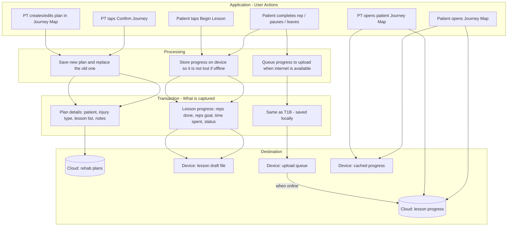
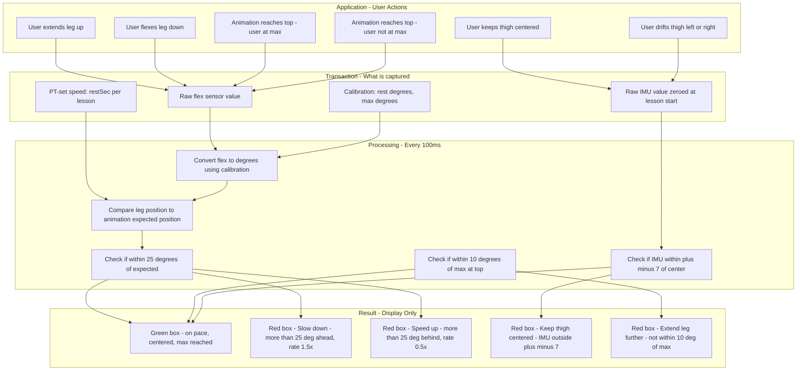
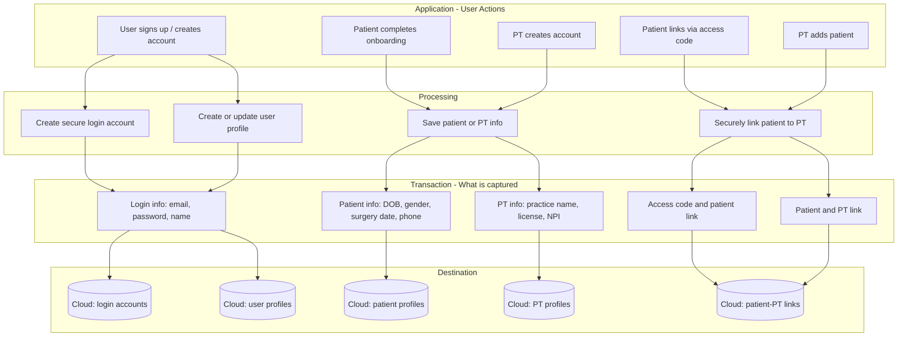
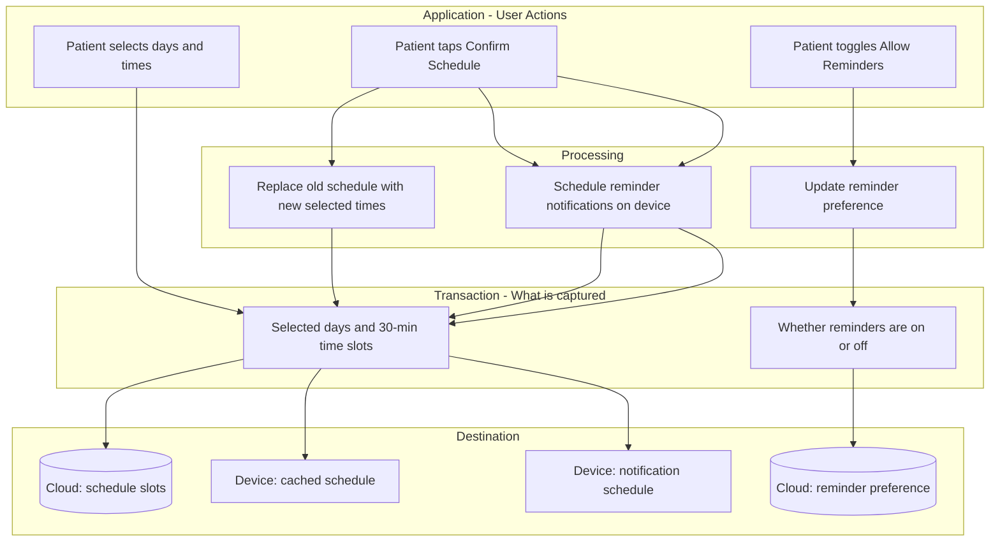
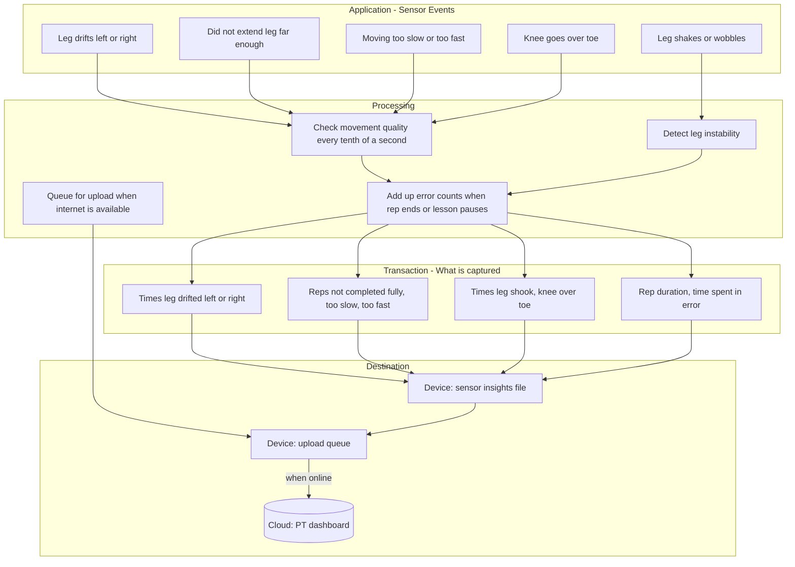

# RealRehab Data Flow Documentation

Comprehensive data flow analysis and visual documentation for the RealRehab app. Organizes all data into buckets, identifies the top 3 most impactful modules, and shows Application (user action) → Processing → Transaction (data) → Destination (Supabase vs local storage).

---

## 1. Complete Data Inventory

### Supabase Tables (Cloud Storage)

| Schema    | Table                          | Key Fields                                                                                                                                  | Used By                               |
| --------- | ------------------------------ | ------------------------------------------------------------------------------------------------------------------------------------------- | ------------------------------------- |
| accounts  | profiles                       | user_id, role, email, first_name, last_name, phone                                                                                          | AuthService                           |
| accounts  | patient_profiles               | profile_id, date_of_birth, gender, surgery_date, last_pt_visit, allow_notifications, allow_camera, schedule_reminders_enabled, intake_notes | PatientService                        |
| accounts  | pt_profiles                    | profile_id, practice_name, license_number, npi_number, contact_email, contact_phone                                                         | PTService                             |
| accounts  | pt_patient_map                 | patient_profile_id, pt_profile_id, status, assigned_at                                                                                      | PatientService, PTService             |
| accounts  | patient_schedule_slots         | patient_profile_id, day_of_week, slot_time                                                                                                  | ScheduleService                       |
| accounts  | rehab_plans                    | pt_profile_id, patient_profile_id, category, injury, status, nodes (JSONB), notes                                                           | RehabService                          |
| accounts  | patient_lesson_progress        | patient_profile_id, lesson_id, reps_completed, reps_target, elapsed_seconds, status                                                         | RehabService, OutboxSyncManager (RPC) |
| rehab     | assignments, programs, lessons | (legacy - program-based)                                                                                                                    | RehabService (partial)                |
| telemetry | devices, device_assignments    | bluetooth_serial, patient_profile_id, pt_profile_id                                                                                         | TelemetryService (RPC)                |
| telemetry | calibrations                   | device_assignment_id, stage, flex_value, knee_angle_deg, recorded_at                                                                        | TelemetryService                      |

### Local Storage (Disk)

| Location                                  | Format | Data                                                                   | Purpose                                                                                                             |
| ----------------------------------------- | ------ | ---------------------------------------------------------------------- | ------------------------------------------------------------------------------------------------------------------- |
| `RealRehabLessonProgress/{lessonId}.json` | JSON   | lessonId, repsCompleted, repsTarget, elapsedSeconds, updatedAt, status | Offline lesson draft resume ([LocalLessonProgressStore](../RealRehabPractice/Services/LocalLessonProgressStore.swift)) |
| `RealRehabOutbox/outbox.json`             | JSON   | OutboxItem[] (LessonProgressPayload)                                   | Pending sync queue when offline ([OutboxSyncManager](../RealRehabPractice/Services/Outbox/OutboxSyncManager.swift))    |
| `RealRehabCache/*.json`                   | JSON   | Cached API responses                                                   | Memory + disk cache ([CacheService](../RealRehabPractice/Services/Cache/CacheService.swift))                           |
| `RealRehabSensorInsights/{lessonId}.json` | JSON   | Sensor event counts (valgus, max_not_reached, speed errors, shake, etc.) | FUTURE: Offline sensor insights draft; syncs via Outbox when online                                                      |

### Cache Keys (Local - Memory + Optional Disk)

From [CacheKey.swift](../RealRehabPractice/Services/Cache/CacheKey.swift): patientProfile, patientEmail, hasPT, ptProfile, ptInfo, ptProfileIdFromPatient, rehabPlan, patientList, patientDetail, activeAssignment, program, lessons, authProfile, patientProfileId, patientSchedule, scheduleRemindersEnabled, calibrationPoints, lessonProgress, plan, resolvedSession.

---

## 2. Data Buckets (Modules by User Flow)

### Bucket A: Identity and Account Data

- **Tables**: profiles, patient_profiles, pt_profiles, pt_patient_map
- **Data**: email, password, role, first_name, last_name, phone, DOB, gender, surgery_date, access_code, practice_name, license_number, NPI, etc.
- **Flow**: Sign up → Supabase Auth + profiles; Create account → patient_profiles/pt_profiles; Link PT → pt_patient_map (RPC); Add patient → pt_patient_map (RPC)
- **Storage**: Supabase only (no local-first for identity)

### Bucket B: Rehab Plan and Lesson Progress

- **Tables**: accounts.rehab_plans, accounts.patient_lesson_progress
- **Data**: Plan nodes (id, title, icon, isLocked, reps, restSec, nodeType, phase), notes; Lesson progress (reps_completed, reps_target, elapsed_seconds, status)
- **Flow**: PT creates/edits plan → Supabase rehab_plans; Patient does lesson → LocalLessonProgressStore (disk) → OutboxSyncManager (disk) → RPC upsert when online → Supabase patient_lesson_progress; PT/Patient views journey map → Supabase → Cache → UI
- **Storage**: Local-first for lesson progress (draft + outbox); Cloud for plans and synced progress

### Bucket C: Schedule Data

- **Tables**: patient_schedule_slots, patient_profiles.schedule_reminders_enabled
- **Data**: day_of_week (0-6), slot_time (HH:mm:ss), boolean for reminders
- **Flow**: Patient sets schedule → Supabase patient_schedule_slots; Toggle reminders → Supabase patient_profiles; NotificationManager schedules local notifications from slots
- **Storage**: Supabase; Cache for UI; Notifications stored locally by iOS

### Bucket D: Device and Calibration Data

- **Tables**: telemetry.devices, telemetry.device_assignments, telemetry.calibrations
- **Data**: bluetooth_identifier, stage (starting_position/maximum_position), flex_value, knee_angle_deg
- **Flow**: Pair device → RPC get_or_create_device_assignment; Calibrate → Supabase calibrations; Used by LessonView for degree conversion
- **Storage**: Supabase only

### Bucket E: PT-Patient Management

- **Tables**: pt_patient_map, patient_profiles (for list/detail)
- **Data**: Patient list (name, profile info), patient detail, mapping status
- **Flow**: PT adds patient (RPC), deletes mapping; PT views list/detail → Supabase → Cache
- **Storage**: Supabase; Cache for list/detail

### Bucket F: Lesson Engine – Real-Time Display (Green/Red)

- **Tables**: None (display only; not stored)
- **Data**: Raw flex sensor value, raw IMU value; converted to degrees and position; compared to animation expected position
- **Flow**: User moves leg → Flex sensor + IMU stream → Convert to degrees (calibration) → Compare to animation (PT-set speed via restSec) → Show green or red on screen
- **Storage**: Screen only. Validation runs every 100ms. **Not persisted anywhere today** – see Bucket G (Future) for where this will be stored.
- **Tolerances** (from LessonView/LessonEngine): Flex position = 25° (keep pace); Max extension = 10°; IMU = ±7 (keep thigh centered). PT sets rep speed via restSec per lesson.

### Bucket G: Sensor-Based Raw Insights (During Lesson) – FUTURE

- **Tables**: accounts.lesson_sensor_insights (or lesson_quality_metrics, lesson_stability_metrics, lesson_biomechanics_metrics)
- **Data**: All events from Bucket F (speed errors, max not reached, IMU drift, etc.) plus shake, anterior migration – persisted as counts
- **Flow**: Same as Bucket F validation → increment counters → Local file (RealRehabSensorInsights) + Outbox → RPC when online → Supabase; PT views via dashboard
- **Storage**: Local-first (RealRehabSensorInsights, Outbox); Supabase when synced

---

## 3. Top 3 Most Impactful Buckets

| Rank | Bucket                             | Rationale                                                                                                                                                                                         |
| ---- | ---------------------------------- | ------------------------------------------------------------------------------------------------------------------------------------------------------------------------------------------------- |
| 1    | **Rehab Plan and Lesson Progress** | Core product flow. Most complex: local-first lesson draft, outbox sync, RPC upsert, bidirectional PT/patient views. Highest data volume during lessons (reps, elapsed, status every rep + timer). |
| 2    | **Lesson Engine – Real-Time Display** | Heart of the lesson experience. Flex + IMU stream, degree conversion, animation sync. Every rep: green/red feedback based on 25° pace, 10° max, ±7 IMU. PT sets speed. Not stored today.           |
| 3    | **Identity and Account Data**      | Foundation for all flows. Auth, profiles, PT-patient linking. Every user touches this on signup, login, and profile/link actions.                                                                 |

*Schedule Data (Bucket C) supports engagement but is not core data capture; it can be reviewed under Bucket C.*

---

## 4. Data Flow Diagrams

For each bucket, the diagram uses four subgraphs:

- **Application**: What the user or sensor does (e.g., "Patient taps Begin Lesson", "PT saves plan")
- **Processing**: What the app does with that action (e.g., "Save plan and replace old one", "Store progress on device so it's not lost offline")
- **Transaction**: What information is captured or sent (e.g., "Plan details: patient, injury type, lessons", "Reps done, reps goal, time spent")
- **Destination**: Where it goes (cloud database or device storage)

### Bucket 1: Rehab Plan and Lesson Progress

### Bucket 2: Lesson Engine – Real-Time Display (Green/Red)

*This diagram shows what happens during every lesson, in real time, on screen. Data is processed but **not stored** today.*

**When the box turns red:**

| Scenario | Tolerance | Processing | Message |
|----------|-----------|------------|---------|
| On pace | Within 25° of animation | Green | — |
| Too fast | >25° ahead + rate >1.5× expected | Red | "Slow down your movement!" |
| Too slow | >25° behind + rate <0.5× expected | Red | "Speed up your Rep!" |
| Thigh drift | IMU outside ±7 | Red | "Keep your thigh centered" |
| Max not reached | Not within 10° of max when animation hits top | Red | "Extend your leg further!" |

**PT sets rep speed** via restSec (seconds between reps) in each lesson node on the Journey Map.

---

### Bucket 3: Identity and Account Data

---

### Bucket 4: Schedule Data

### Bucket G: Sensor-Based Raw Insights (During Lesson) – FUTURE

*Will persist all events from Bucket F (Lesson Engine) that currently only display on screen.*

---

## 5. Replication Instructions

To recreate these diagrams in your preferred tool (e.g., Figma, Lucidchart, draw.io):

1. **Render Mermaid**: Use [mermaid.live](https://mermaid.live), GitHub, or VS Code (Mermaid extension) to view the diagrams.
2. **Export**: From Mermaid Live Editor, export as PNG or SVG.
3. **Manual recreation**: Each subgraph maps to a swimlane or container. Nodes are boxes; arrows show flow. Use plain-language labels: Application (what the user does), Processing (what the app does), Transaction (what is captured), Destination (where it goes).
4. **Color coding**: Consider using distinct colors for Application (blue), Transaction (yellow), and Destination (green) for clarity.
