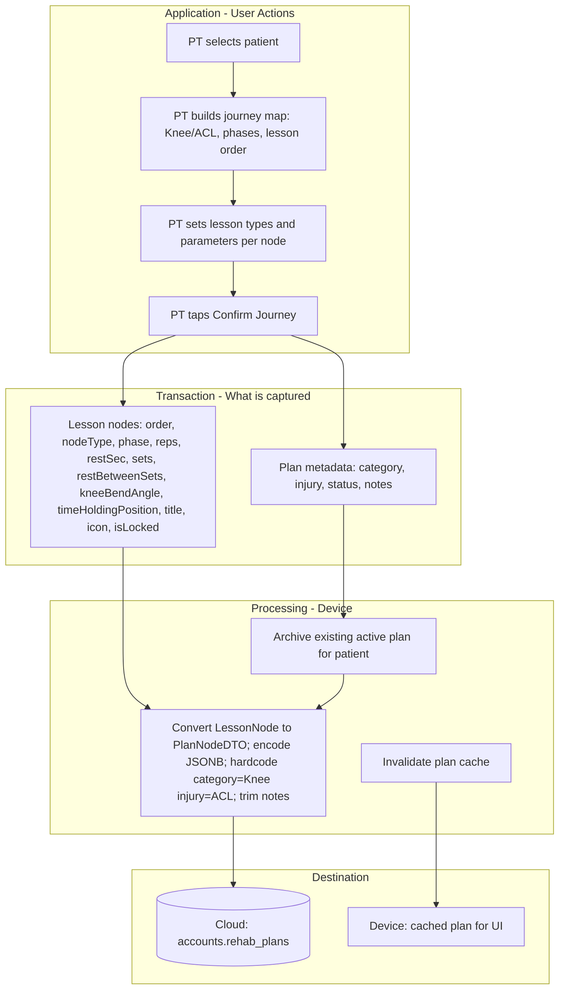
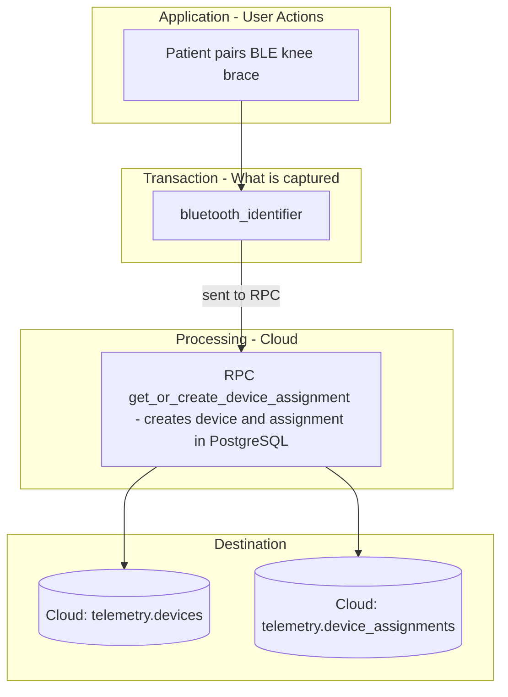
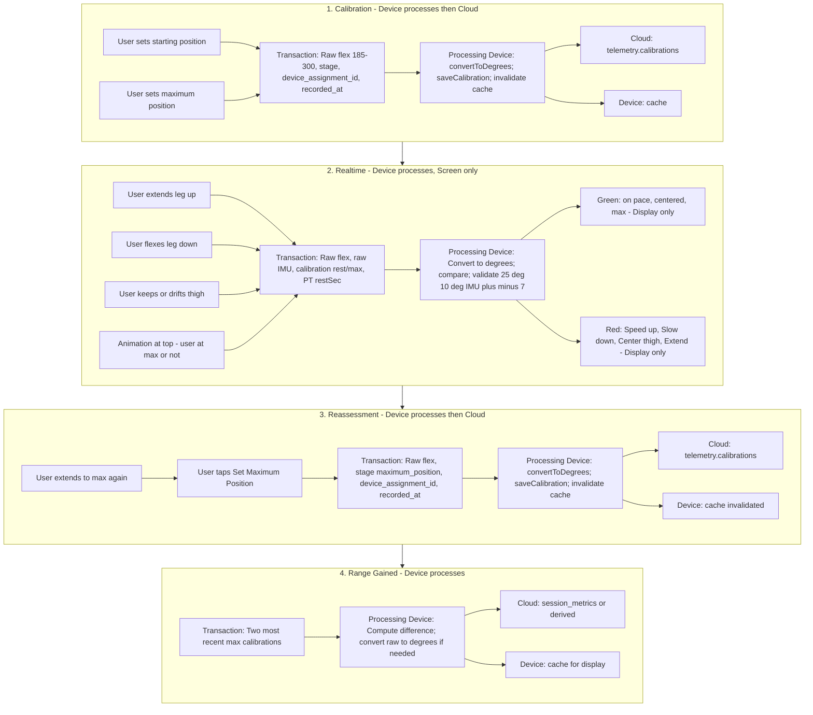
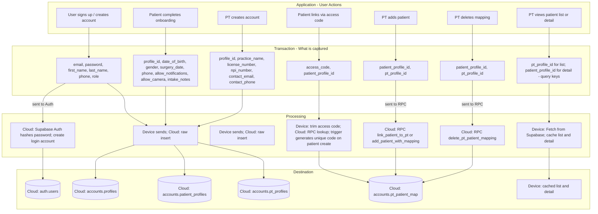
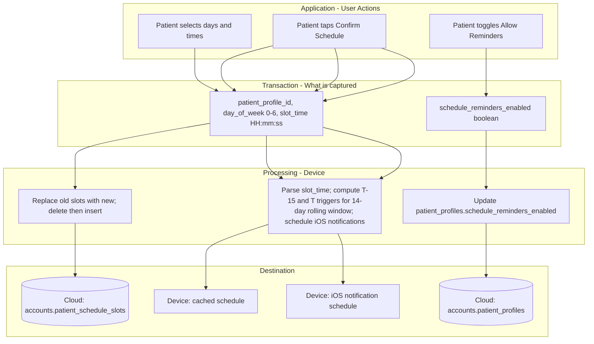
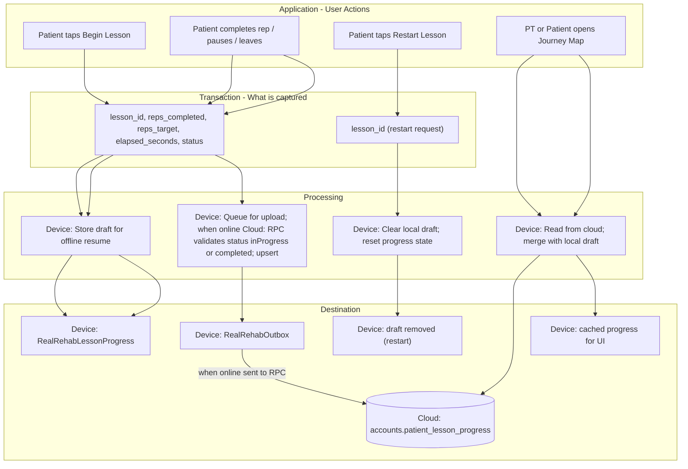
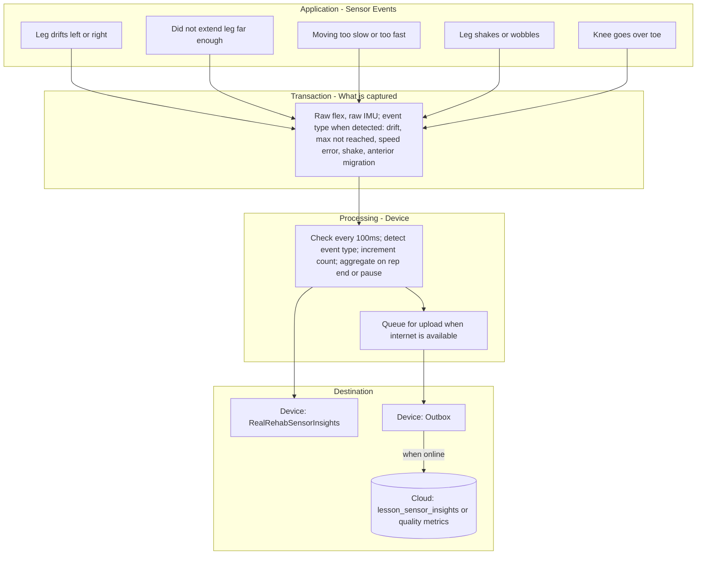

# RealRehab Data Flow Documentation

Comprehensive data flow analysis and visual documentation for the RealRehab app. Organizes all data into buckets, identifies the top 3 most impactful modules, and shows Application (user action) → Transaction (what is captured) → Processing (raw kept or transformed) → Destination (Supabase vs local storage).

---

## 1. Complete Data Inventory

### Supabase Tables (Cloud Storage)

| Schema    | Table                          | Key Fields                                                                                                                                  | Used By                               |
| --------- | ------------------------------ | ------------------------------------------------------------------------------------------------------------------------------------------- | ------------------------------------- |
| accounts  | profiles                       | user_id, role, email, first_name, last_name, phone                                                                                          | AuthService                           |
| accounts  | patient_profiles               | profile_id, date_of_birth, gender, surgery_date, last_pt_visit, allow_notifications, allow_camera, schedule_reminders_enabled, intake_notes | PatientService                        |
| accounts  | pt_profiles                    | profile_id, practice_name, license_number, npi_number, contact_email, contact_phone                                                         | PTService                             |
| accounts  | pt_patient_map                 | patient_profile_id, pt_profile_id, status, assigned_at                                                                                      | PatientService, PTService             |
| accounts  | patient_schedule_slots         | patient_profile_id, day_of_week, slot_time                                                                                                  | ScheduleService                       |
| accounts  | rehab_plans                    | pt_profile_id, patient_profile_id, category, injury, status, nodes (JSONB), notes                                                           | RehabService                          |
| accounts  | patient_lesson_progress        | patient_profile_id, lesson_id, reps_completed, reps_target, elapsed_seconds, status                                                         | RehabService, OutboxSyncManager (RPC) |
| rehab     | assignments, programs, lessons | (legacy - program-based)                                                                                                                    | RehabService (partial)                |
| telemetry | devices, device_assignments    | bluetooth_serial, patient_profile_id, pt_profile_id                                                                                         | TelemetryService (RPC)                |
| telemetry | calibrations                   | device_assignment_id, stage, flex_value, knee_angle_deg, recorded_at                                                                        | TelemetryService                      |

### Local Storage (Disk)

| Location                                  | Format | Data                                                                   | Purpose                                                                                                             |
| ----------------------------------------- | ------ | ---------------------------------------------------------------------- | ------------------------------------------------------------------------------------------------------------------- |
| `RealRehabLessonProgress/{lessonId}.json` | JSON   | lessonId, repsCompleted, repsTarget, elapsedSeconds, updatedAt, status | Offline lesson draft resume ([LocalLessonProgressStore](../RealRehabPractice/Services/LocalLessonProgressStore.swift)) |
| `RealRehabOutbox/outbox.json`             | JSON   | OutboxItem[] (LessonProgressPayload)                                   | Pending sync queue when offline ([OutboxSyncManager](../RealRehabPractice/Services/Outbox/OutboxSyncManager.swift))    |
| `RealRehabCache/*.json`                   | JSON   | Cached API responses                                                   | Memory + disk cache ([CacheService](../RealRehabPractice/Services/Cache/CacheService.swift))                           |
| `RealRehabSensorInsights/{lessonId}.json` | JSON   | Sensor event counts (valgus, max_not_reached, speed errors, shake, etc.) | FUTURE: Offline sensor insights draft; syncs via Outbox when online                                                      |

### Cache Keys (Local - Memory + Optional Disk)

From [CacheKey.swift](../RealRehabPractice/Services/Cache/CacheKey.swift): patientProfile, patientEmail, hasPT, ptProfile, ptInfo, ptProfileIdFromPatient, rehabPlan, patientList, patientDetail, activeAssignment, program, lessons, authProfile, patientProfileId, patientSchedule, scheduleRemindersEnabled, calibrationPoints, lessonProgress, plan, resolvedSession.

---

## 2. Data Buckets (Modules by User Flow)

### Bucket A: Identity and Account Data (incl. PT-Patient Management)

- **Tables**: profiles, patient_profiles, pt_profiles, pt_patient_map
- **Data**: email, password, role, first_name, last_name, phone, DOB, gender, surgery_date, access_code, practice_name, license_number, NPI, patient_profile_id, pt_profile_id
- **Flow**: Sign up → Supabase Auth + profiles; Create account → patient_profiles/pt_profiles; Patient links via access code → pt_patient_map (RPC); PT adds patient → pt_patient_map (RPC); PT deletes mapping → pt_patient_map (RPC); PT views list/detail → Supabase → Cache
- **Storage**: Supabase; Cache for PT list/detail

### Bucket B: PT Creates Rehab Plan

- **Tables**: accounts.rehab_plans
- **Data**: Plan metadata (category, injury, status, notes); Lesson nodes as JSONB: order, node types (lesson vs benchmark), phase (1–4), lesson parameters (reps, restSec, sets, restBetweenSets, kneeBendAngle, timeHoldingPosition), title, icon, isLocked
- **Flow**: PT selects patient → builds journey map (Knee/ACL, phases, lesson order, types within each phase, parameters per lesson) → taps Confirm → RehabService.saveACLPlan → Supabase rehab_plans; Cache invalidated
- **Storage**: Cloud (Supabase); Cache for UI (short TTL)

### Bucket C: Schedule Data

- **Tables**: patient_schedule_slots, patient_profiles.schedule_reminders_enabled
- **Data**: day_of_week (0-6), slot_time (HH:mm:ss), boolean for reminders
- **Flow**: Patient sets schedule → Supabase patient_schedule_slots; Toggle reminders → Supabase patient_profiles; NotificationManager schedules local notifications from slots
- **Storage**: Supabase; Cache for UI; Notifications stored locally by iOS

### Bucket D: Device Pairing

- **Tables**: telemetry.devices, telemetry.device_assignments
- **Data**: bluetooth_identifier, device_id, patient_profile_id, pt_profile_id
- **Flow**: Pair device → RPC get_or_create_device_assignment → telemetry.devices, telemetry.device_assignments
- **Storage**: Supabase only. *Calibration data (min/max) is in Bucket F (Lesson Engine).*

### Bucket F: Lesson Engine – Calibration, Realtime Display, Reassessment, Range Gained

- **Tables**: telemetry.calibrations, telemetry.devices, telemetry.device_assignments; rehab.session_metrics (range_of_motion_deg for range gained)
- **Data**: Calibration (stage, flex_value, knee_angle_deg); raw flex/IMU during lesson; reassessment max; range gained (computed: reassessment max − original max)
- **Flow**: (1) Patient calibrates: starting_position, maximum_position → TelemetryService.saveCalibration → telemetry.calibrations; cache. (2) Patient does lesson: flex/IMU stream → convert to degrees (uses calibration) → compare to animation → green/red on screen (not stored). (3) Reassessment after lesson: patient extends to max → save new maximum_position → telemetry.calibrations. (4) Range gained: original max + reassessment max → compute difference → display; stored locally and in cloud (rehab.session_metrics or derived from calibrations)
- **Storage**: Calibration and reassessment → Cloud (telemetry.calibrations); Device (cache). Range gained → computed from calibrations; stored locally (cache) and cloud (rehab.session_metrics or calibration-derived). Realtime green/red → screen only (Bucket G future for error counts).
- **Tolerances** (from LessonView/LessonEngine): Flex position = 25° (keep pace); Max extension = 10°; IMU = ±7 (keep thigh centered). PT sets rep speed via restSec per lesson.

### Bucket G: Sensor-Based Raw Insights (During Lesson) – FUTURE

- **Tables**: accounts.lesson_sensor_insights (or lesson_quality_metrics, lesson_stability_metrics, lesson_biomechanics_metrics)
- **Data**: All events from Bucket F (speed errors, max not reached, IMU drift, etc.) plus shake, anterior migration – persisted as counts
- **Flow**: Same as Bucket F validation → increment counters → Local file (RealRehabSensorInsights) + Outbox → RPC when online → Supabase; PT views via dashboard
- **Storage**: Local-first (RealRehabSensorInsights, Outbox); Supabase when synced

### Bucket H: Lesson Progress (Saving Reps and Status)

- **Tables**: accounts.patient_lesson_progress
- **Data**: lesson_id, reps_completed, reps_target, elapsed_seconds, status
- **Flow**: Patient does lesson → LocalLessonProgressStore (disk) → OutboxSyncManager (disk) → RPC upsert when online → Supabase patient_lesson_progress; PT/Patient views journey map → Supabase → Cache → UI
- **Storage**: Local-first (draft + outbox); Cloud when synced

---

## 3. Top 3 Most Impactful Buckets (Project to Date)

| Rank | Bucket                             | Rationale                                                                                                                                                                                         |
| ---- | ---------------------------------- | ------------------------------------------------------------------------------------------------------------------------------------------------------------------------------------------------- |
| 1    | **Identity and Account Data**      | Foundation for all flows. Auth, profiles, PT-patient linking. Every user touches this on signup, login, and profile/link actions.                                                                 |
| 2    | **PT Creates Rehab Plan**          | Core prescription flow. PT defines knee/ACL plan, phases, lesson order, types, and parameters (reps, restSec, sets, etc.). Stored in rehab_plans.                                                  |
| 3    | **Lesson Engine** | Calibration (min/max) → lesson (green/red) → reassessment (new max) → range gained. Calibration and reassessment in telemetry.calibrations; range gained computed and stored locally + cloud. Realtime feedback uses calibration; not persisted (Bucket G future). |

*Schedule (Bucket C), Lesson Progress (Bucket H), and Sensor Insights (Bucket G) support the core flow.*

---

## 4. Data Flow Diagrams

For each bucket, the diagram uses four subgraphs in order:

- **Application**: What the user or sensor does (e.g., "Patient taps Begin Lesson", "PT saves plan")
- **Transaction**: What information is captured first (e.g., "Plan metadata and nodes", "Reps done, reps goal, time spent")
- **Processing**: What the app does with that data—raw kept or transformed. Processing may happen on **Device** (before data reaches cloud) or in **Cloud** (RPC, trigger, Supabase Auth).
- **Destination**: Where it goes (cloud database or device storage)

**Two processing patterns:**
- **Device → Cloud**: Transaction → Processing on device → Destination (cloud or device). Data is transformed before it reaches the database.
- **Transaction → Cloud → Process**: Transaction → Sent to cloud → Processing runs in cloud (RPC, trigger, Auth). Data reaches the database first; processing happens there.

### Bucket B: PT Creates Rehab Plan

*Processing: **Device**. Transaction → Device processes → Cloud.*

### Bucket D: Device Pairing

*Processing: **Cloud**. Transaction → Sent to RPC → RPC processes in cloud (creates device, assignment) → Cloud.*

### Bucket F: Lesson Engine – Calibration, Realtime Display, Reassessment, Range Gained

*Full flow: Calibrate (min/max) → Do lesson (green/red) → Reassessment (new max) → Range gained (computed and stored).*

#### Step 1: Calibration (Before Lesson)

*Processing: **Device**. Transaction → Device processes (convertToDegrees) → Cloud.*

| | |
|---|---|
| **Application** | Patient taps "Set Starting Position" while leg is bent ~90°; then taps "Set Maximum Position" while leg is fully extended. |
| **Transaction** | Raw flex sensor value (185–300), stage (starting_position \| maximum_position), device_assignment_id, recorded_at |
| **Processing** | **Device**: Convert raw sensor to degrees via convertToDegrees(); TelemetryService.saveCalibration → insert; invalidate calibration cache |
| **Destination** | Cloud: telemetry.calibrations. Device: cache (calibrationPoints, used when lesson loads) |

#### Step 2: Realtime Display (During Lesson)

*Processing: **Device**. Transaction → Device processes → Screen only (not persisted).*

| | |
|---|---|
| **Application** | Patient moves leg through reps; flex sensor and IMU stream continuously. |
| **Transaction** | Raw flex sensor value, raw IMU value; calibration rest/max degrees (read from step 1); PT-set restSec per lesson |
| **Processing** | **Device**: Every 100ms: convert raw flex to degrees; compare to animation; validate max (10°), pace (25°), IMU (±7); show green or red on screen |
| **Destination** | Screen only (not persisted). Future: Bucket G will store error counts. |

#### Step 3: Reassessment (After Lesson)

*Processing: **Device**. Transaction → Device processes (convertToDegrees) → Cloud.*

| | |
|---|---|
| **Application** | Patient extends leg to max again; taps "Set Maximum Position." |
| **Transaction** | Raw flex sensor value, stage (maximum_position), device_assignment_id, recorded_at |
| **Processing** | **Device**: Convert raw sensor to degrees via convertToDegrees(); TelemetryService.saveCalibration → insert new row; invalidate calibration cache |
| **Destination** | Cloud: telemetry.calibrations. Device: cache invalidated. |

#### Step 4: Range Gained

*Processing: **Device**. Transaction (fetch from cloud) → Device processes (compute difference) → Device cache / Cloud (if stored).*

| | |
|---|---|
| **Application** | Patient views Completion screen; app displays range gained. |
| **Transaction** | Two most recent maximum_position records from telemetry.calibrations (original max from step 1; reassessment max from step 3) |
| **Processing** | **Device**: TelemetryService.getAllMaximumCalibrationsForPatient → compute difference (reassessment max − original max); convert raw to degrees if needed |
| **Destination** | Cloud: rehab.session_metrics.range_of_motion_deg or derived from calibrations. Device: cache for display. |

**Realtime green/red** (during lesson):

| Scenario | Tolerance | Processing | Message |
|----------|-----------|------------|---------|
| On pace | Within 25° of animation | Green | — |
| Too fast | >25° ahead + rate >1.5× expected | Red | "Slow down your movement!" |
| Too slow | >25° behind + rate <0.5× expected | Red | "Speed up your Rep!" |
| Thigh drift | IMU outside ±7 | Red | "Keep your thigh centered" |
| Max not reached | Not within 10° of max when animation hits top | Red | "Extend your leg further!" |

**PT sets rep speed** via restSec (seconds between reps) in each lesson node on the Journey Map.

---

### Bucket 3: Identity and Account Data (incl. PT-Patient Management)

*Processing: **Mixed**. Signup → Cloud (Auth hashes password). Profiles → Device sends raw → Cloud. Patient link → Device trim + Cloud RPC. PT add/delete → Cloud RPC. PT view → Device fetch + cache.*

---

### Bucket 4: Schedule Data

*Processing: **Device**. Transaction → Device processes (parse, compute triggers, schedule notifications) → Cloud + Device.*

### Bucket H: Lesson Progress

*Processing: **Device** for draft, restart reset, and queue. **Cloud** when syncing (RPC validates status, upserts).*

### Bucket G: Sensor-Based Raw Insights (During Lesson) – FUTURE

*Processing: **Device**. Transaction → Device processes (detect, increment, aggregate) → Device storage; when online → Cloud.*

*Will persist all events from Bucket F (Lesson Engine) that currently only display on screen.*

---

## 5. Replication Instructions

To recreate these diagrams in your preferred tool (e.g., Figma, Lucidchart, draw.io):

1. **Render Mermaid**: Use [mermaid.live](https://mermaid.live), GitHub, or VS Code (Mermaid extension) to view the diagrams.
2. **Export**: From Mermaid Live Editor, export as PNG or SVG.
3. **Manual recreation**: Each subgraph maps to a swimlane or container. Nodes are boxes; arrows show flow. Order: Application → Transaction (what is captured) → Processing (raw kept or transformed) → Destination (where it goes).
4. **Color coding**: Consider using distinct colors for Application (blue), Transaction (yellow), and Destination (green) for clarity.
