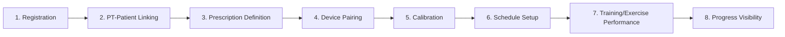
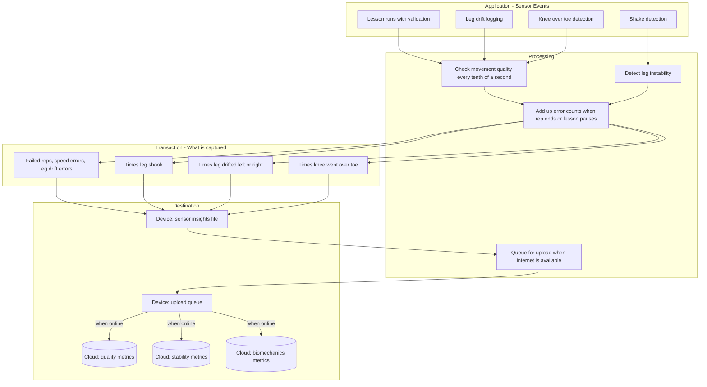

# RealRehab Data Story - Professor Presentation

Comprehensive "data story" presentation document: key functional modules with logical sequence, what happens in each, data collected/used/processed/stored (project to date), plus the next three future features/modules with specific telemetry (leg shake, failed reps, anterior knee migration, dynamic valgus).

---

## Part 1: Project to Date - The Data Story

### Slide 1: Title and Overview

- **RealRehab Data Story**: Connecting patients and physical therapists through sensor-guided rehabilitation
- Two user types: Patient and PT
- Data flows: Registration → Prescription (plan) → Device pairing → Training (lessons) → Progress visibility

---

### Slide 2: Logical Sequence of Modules (High-Level)

---

### Slide 3: Module 1 - Registration

**What happens**: User signs up (email, password) or logs in. Creates account with role (patient or PT). Patient completes onboarding (DOB, gender, surgery date, phone). PT completes profile (practice name, license, NPI).

**Data collected**: email, password, role, first_name, last_name, phone, date_of_birth, gender, surgery_date, last_pt_visit, practice_name, license_number, npi_number, contact_email, contact_phone

**Processing**: Supabase Auth creates auth.users; AuthService.ensureProfile upserts accounts.profiles; PatientService/PTService upsert patient_profiles or pt_profiles

**Storage**:
- Supabase Auth (auth.users) - permanent
- accounts.profiles - permanent, raw
- accounts.patient_profiles / accounts.pt_profiles - permanent, raw
- Local: CacheService (authProfile, resolvedSession) - memory + disk, TTL 24h–7 days for offline launch

---

### Slide 4: Module 2 - PT-Patient Linking

**What happens**: Patient links to PT via access code. PT adds patient (creates placeholder or mapping). Establishes care relationship.

**Data collected**: access_code, patient_profile_id, pt_profile_id, status (pending/active/archived)

**Processing**: RPCs (link_patient_via_access_code, add_patient_with_mapping) bypass RLS for secure linking

**Storage**: accounts.pt_patient_map - permanent, raw. Cache: hasPT, ptProfileIdFromPatient, patientList, patientDetail - TTL 5–60 min

---

### Slide 5: Module 3 - Prescription Definition (Rehab Plan)

**What happens**: PT selects patient, chooses category/injury, builds journey map with lesson nodes (title, reps, rest, phase, locked state). Saves plan. Patient sees plan on journey map.

**Data collected**: pt_profile_id, patient_profile_id, category, injury, status, nodes (JSON: id, title, icon, isLocked, reps, restSec, nodeType, phase), notes

**Processing**: RehabService.saveACLPlan archives old active plan, inserts new. Nodes stored as JSONB. JourneyMapViewModel/PTJourneyMapView fetch and render.

**Storage**: accounts.rehab_plans - permanent, processed (nodes are structured). Cache: rehabPlan, plan - TTL 5–10 min, disk persistence for offline

---

### Slide 6: Module 4 - Device Pairing

**What happens**: Patient pairs BLE knee brace (Arduino + flex sensor + IMU). App scans, connects, subscribes to characteristics.

**Data collected**: bluetooth_identifier (peripheral UUID), device_id, patient_profile_id, pt_profile_id

**Processing**: RPC get_or_create_device_assignment creates telemetry.devices and device_assignments

**Storage**: telemetry.devices, telemetry.device_assignments - permanent, raw. No local persistence of pairing state (reconnects on app launch)

---

### Slide 7: Module 5 - Calibration

**What happens**: Patient holds starting position, then maximum extension. App records flex_value (and optionally knee_angle_deg) for each stage. Used to convert raw sensor values to degrees during lessons.

**Data collected**: device_assignment_id, stage (starting_position, maximum_position), flex_value, knee_angle_deg, recorded_at, notes

**Processing**: TelemetryService.saveCalibration inserts. getMostRecentCalibration fetches and derives restDegrees, maxDegrees for LessonView degree conversion.

**Storage**: telemetry.calibrations - permanent, raw. Cache: calibrationPoints - TTL 10 min, disk. Used to compute degree range (90–180) from sensor range (185–300)

---

### Slide 8: Module 6 - Schedule Setup

**What happens**: Patient selects days and times (30-min blocks, up to 2 per day). Toggles "Allow reminders." App schedules T-15 and T notifications.

**Data collected**: patient_profile_id, day_of_week (0–6), slot_time (HH:mm:ss), schedule_reminders_enabled (boolean)

**Processing**: ScheduleService.saveSchedule replaces slots (delete + insert). PatientService.setScheduleRemindersEnabled updates patient_profiles. NotificationManager schedules local notifications from slots.

**Storage**: accounts.patient_schedule_slots - permanent, raw. patient_profiles.schedule_reminders_enabled - permanent. Cache: patientSchedule - TTL 24h, disk. iOS NotificationManager - local, 14-day rolling window

---

### Slide 9: Module 7 - Training/Exercise Performance (Core)

**What happens**: Patient opens lesson from journey map, views directions, taps Begin Lesson. Flex sensor + IMU stream live. LessonEngine guides rep timing. Validation: max extension reached, movement speed, IMU lateral drift (keep thigh centered). Errors turn box red, invalidate rep. Progress saved locally first, synced when online.

**Data collected (during lesson)**:
- Real-time (not persisted): flex_value, IMU value, currentDegrees, phase, rep count
- Persisted: lesson_id, reps_completed, reps_target, elapsed_seconds, status (inProgress/completed)

**Processing**:
- LocalLessonProgressStore saves draft to disk (every rep, timer, pause)
- OutboxSyncManager enqueues payload when sync triggered (start, every rep, every 10s, pause, complete)
- When online: LessonProgressSync.upsert RPC writes to patient_lesson_progress
- Validation logic: validateMaxReached, validateMovementSpeed, validateIMU (threshold 7) - used only for real-time feedback, not stored
- **Sensor error counts (max not reached, speed, IMU) are computed but not persisted today** – see Future Bucket F

**Storage**:
- Local: RealRehabLessonProgress/{lessonId}.json - disk, until lesson completed or cleared
- Local: RealRehabOutbox/outbox.json - disk, until sync succeeds
- Supabase: accounts.patient_lesson_progress - permanent, processed (aggregate per lesson). Cache: lessonProgress - TTL 10 min, disk

---

### Slide 10: Module 8 - Progress Visibility

**What happens**: Patient views journey map (own progress). PT views patient journey map (patient progress). Progress bars show reps_completed/reps_target, inProgress vs completed.

**Data collected/used**: patient_profile_id, lesson_id, reps_completed, reps_target, status (from patient_lesson_progress)

**Processing**: RehabService.getLessonProgress fetches by patient_profile_id. Merged with LocalLessonProgressStore drafts for patient view. PT view uses RLS policy (patient_lesson_progress_select_pt) for pt_patient_map linked patients.

**Storage**: Supabase patient_lesson_progress - read. Cache: lessonProgress - TTL 10 min, disk. PT pull-to-refresh invalidates cache for fresh data.

---

### Slide 11: Data Storage Summary (Project to Date)

| Location | Data | Duration | Raw/Processed |
|----------|------|----------|---------------|
| Supabase Auth | auth.users | Permanent | Raw |
| accounts.* | profiles, patient_profiles, pt_profiles, pt_patient_map, rehab_plans, patient_lesson_progress, patient_schedule_slots | Permanent | Mix (nodes JSONB processed) |
| telemetry.* | devices, device_assignments, calibrations | Permanent | Raw |
| Local disk | Lesson draft, Outbox | Until sync/complete | Raw |
| Cache | API responses | TTL 5 min–7 days | Processed (decoded) |

---

## Part 2: Next Three Features/Modules (Future)

### Slide 12: Future Overview

Three new modules to capture **exercise quality and movement biomechanics** for PT analysis and patient feedback. Data currently used only for real-time feedback (red box, rep invalidation) will be **persisted and aggregated**.

---

### Slide 13: Future Module 1 - Exercise Quality Metrics (Failed Reps and Errors)

**What it does**: Persist counts of failed reps and error types per lesson. PT sees "how many times the lesson turned red" and error breakdown.

**Data to collect**:
- failed_rep_count (reps where hasSpeedError, hasIMUError, or !lastRepWasValid)
- speed_error_count (too fast / too slow)
- imu_error_count (thigh not centered - dynamic valgus proxy)
- max_not_reached_count (did not extend leg far enough)

**Processing**: Validation logic increments counters in LessonView when validation triggers. On rep/pause/complete, aggregate into payload; write to local file; enqueue to Outbox. Aggregate per lesson_id in DB.

**Storage**: Local-first: RealRehabSensorInsights + Outbox. Sync to Supabase when online. New table: accounts.lesson_quality_metrics (patient_profile_id, lesson_id, failed_rep_count, speed_error_count, imu_error_count, max_not_reached_count, completed_at). PT views via new dashboard.

**Logical sequence**: Runs during Module 7 (Training), persists at lesson end. Feeds Module 8 (Progress Visibility) for PT dashboard.

---

### Slide 14: Future Module 2 - Leg Shake and Stability Metrics

**What it does**: Detect and count leg shakes (sensor instability) during exercise. Indicator of muscle fatigue or poor control.

**Data to collect**:
- shake_count (number of rapid oscillations in flex sensor or IMU above threshold)
- shake_events (optional: timestamps of each shake for timeline analysis)
- Definition: high-frequency, low-amplitude variation in sensor value over short window (e.g., 200ms)

**Processing**: Shake detection algorithm (variance or derivative threshold over 200ms sliding window). Validation logic increments counter when shake detected. On rep/pause/complete, aggregate into payload; write to local file; enqueue to Outbox. Persist at lesson end.

**Storage**: Local-first: RealRehabSensorInsights + Outbox. Sync to Supabase when online. New table: accounts.lesson_stability_metrics (patient_profile_id, lesson_id, shake_count, session_duration_seconds). PT views via new dashboard.

**Logical sequence**: Runs during Module 7 (Training). Feeds Future Module 3 (Data Analysis).

---

### Slide 15: Future Module 3 - Form and Biomechanics (Anterior Knee Migration, Dynamic Valgus)

**What it does**: Track anterior knee migration (knee over toe) and dynamic valgus (knee drift medial/lateral). Requires additional sensor or camera, or derived from existing IMU + flex.

**Data to collect**:
- anterior_migration_count (knee forward of toe line - may need camera or second sensor)
- valgus_left_count (knee drifted left of center)
- valgus_right_count (knee drifted right of center)
- IMU already provides lateral drift (validateIMU) - can persist imu_excursion_count or max_imu_deviation per rep

**Processing**:
- Valgus: Extend current IMU validation to log each excursion event and direction. Validation logic increments counters. On rep/pause/complete, aggregate into payload; write to local file; enqueue to Outbox.
- Anterior migration: New sensor (e.g., forward-facing distance) or computer vision from camera. Count events when knee crosses "safe" line.

**Storage**: Local-first: RealRehabSensorInsights + Outbox. Sync to Supabase when online. New table: accounts.lesson_biomechanics_metrics (patient_profile_id, lesson_id, anterior_migration_count, valgus_left_count, valgus_right_count, max_imu_deviation_per_rep). PT views via new dashboard.

**Logical sequence**: Runs during Module 7 (Training). Feeds Future Data Analysis module for PT insights.

---

### Slide 16: Future Bucket F - Sensor-Based Raw Insights

**Purpose**: Capture all sensor-derived events during a lesson for PT analysis. Local-first so data is saved even when offline; syncs to Supabase when online.

**Sensor events to capture**:
- valgus_left_count, valgus_right_count (IMU lateral drift)
- max_not_reached_count (flex - did not extend leg far enough)
- speed_too_slow_count, speed_too_fast_count (flex + time)
- shake_count (flex or IMU - high-frequency oscillation)
- anterior_migration_count (IMU or camera - knee over toe)

**Optional raw data**: rep_duration, time_in_error_seconds, max_extension_achieved_per_rep, peak_imu_deviation_per_rep

**Processing**: App checks movement quality every tenth of a second; detects leg instability; adds up error counts when a rep ends or lesson pauses; queues data for upload when internet is available

**Storage**: Device file → upload queue → Cloud (PT dashboard) when online

---

### Slide 17: Future Data Flow Diagram

---

### Slide 18: Future Module 4 (Optional) - Data Analysis and Reporting

**What it does**: Aggregate quality, stability, and biomechanics metrics across lessons. PT dashboard: trends, recovery charts, "patient improved on valgus this week."

**Data used**: All lesson-level metrics from Future Modules 1–3, plus existing patient_lesson_progress.

**Processing**: Queries by patient_profile_id, date range. Compute trends, compare to previous weeks. Optional: ML for risk scoring.

**Storage**: Read from new tables. Cache for dashboard. No new write tables; analysis is read-only aggregation.

---

## Slide Conversion Notes

- Each `### Slide N:` section maps to one slide (Slides 1–18).
- Copy into Google Slides, PowerPoint, or Keynote.
- Mermaid diagrams can be rendered at [mermaid.live](https://mermaid.live) and exported as PNG/SVG for slides.
