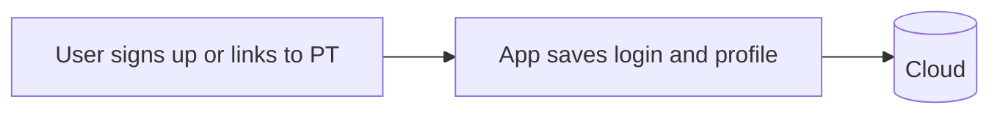
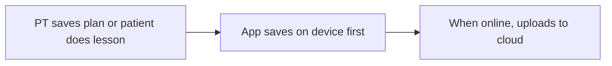
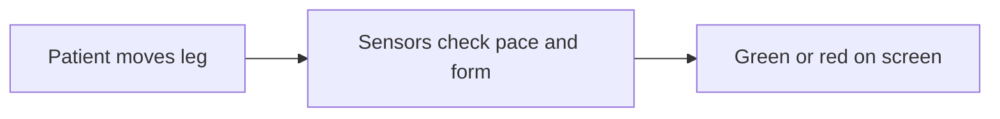
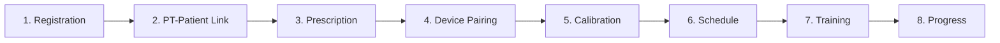
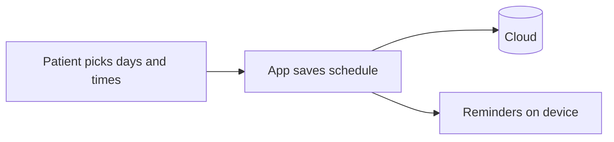
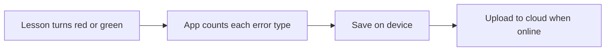
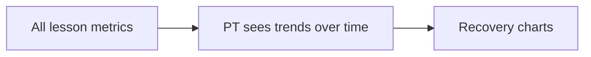

# RealRehab Data Story - Professor Presentation

**RealRehab**: Connecting patients and physical therapists through sensor-guided rehabilitation.

---

## Part A: Project to Date

### Slide 1: The 3 Most Important Modules (In Order)

**1. Identity** → **2. Rehab Plan** → **3. Lesson Engine**

| Order | Module | What it does |
|-------|--------|--------------|
| 1 | Identity | Sign up, login, link patient to PT |
| 2 | Rehab Plan | PT creates lesson plan; patient progress saved |
| 3 | Lesson Engine | During lesson: green/red feedback from sensors |

---

### Slide 2: Module 1 – Identity (Data Flow)

**What happens**: Sign up, login, patient links to PT via code.  
**Data**: Login, name, DOB, surgery date, practice info.  
**Stored**: Cloud, permanent.

---

### Slide 3: Module 2 – Rehab Plan (Data Flow)

**What happens**: PT creates plan; patient does lesson; progress saved.  
**Data**: Lesson list, reps done, time spent.  
**Stored**: Device (offline) → Cloud (when online).

---

### Slide 4: Module 3 – Lesson Engine (Data Flow)

**What happens**: Flex + IMU check every 100ms. Green = on pace; red = too fast, too slow, leg drift, or max not reached.  
**Data**: Sensor values. Not stored today.  
**Stored**: Screen only.

---

### Slide 5: Full Order of All Modules

---

## Part B: Next Three Future Modules

### Slide 6: Future 1 – Schedule (Done)

**What happens**: Patient selects days and 30‑min slots; toggles reminders.  
**Data**: Days, times, reminders on/off.  
**Stored**: Cloud + device notifications.

---

### Slide 7: Future 2 – Sensor Insights (Bucket G)

**What happens**: Count errors (too fast, too slow, leg drift, max not reached, shake, knee over toe). Save on device; sync when online.  
**Data**: Error counts per lesson.  
**Stored**: Device → Cloud (PT dashboard).

---

### Slide 8: Future 3 – Data Analysis

**What happens**: PT views trends, recovery charts, “patient improved on X this week.”  
**Data**: Quality, stability, biomechanics across lessons.  
**Stored**: Read from cloud. No new tables.

---

## Slide Conversion Notes

- Slides 1–8. One module per slide.
- Mermaid: [mermaid.live](https://mermaid.live) → export PNG/SVG for slides.
