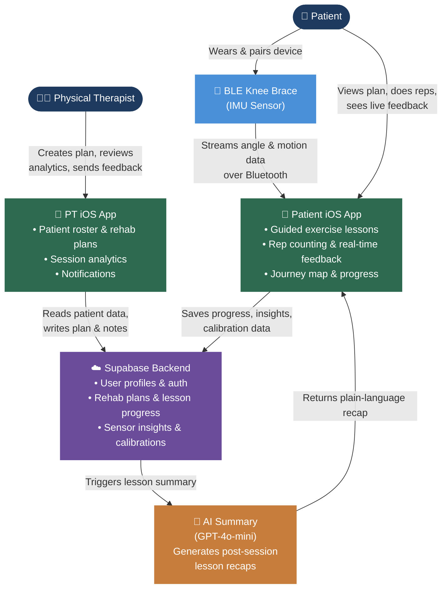
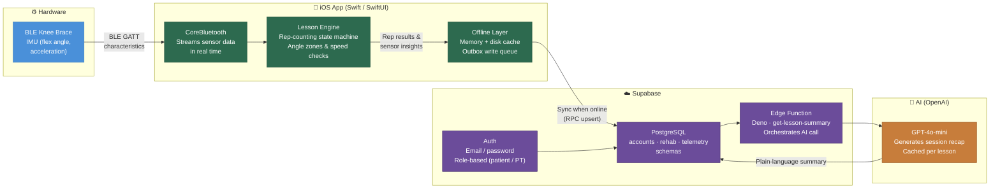

# RealRehab — Pitch Diagrams

Two one-slide diagrams for the final capstone presentation. Render via GitHub or [mermaid.live](https://mermaid.live).

---

## Diagram 1 — System Level Diagram

How RealRehab works end-to-end: users, data flows, and core system components.

---

## Diagram 2 — Technical Architecture Flow

The specific technologies powering each layer of the system.

---

### Reading Guide

| Color | Layer |
|---|---|
| 🔵 Blue | Hardware (BLE knee brace) |
| 🟢 Green | iOS app (Swift / SwiftUI) |
| 🟣 Purple | Backend (Supabase — auth, database, edge functions) |
| 🟠 Orange | AI (OpenAI GPT-4o-mini) |
